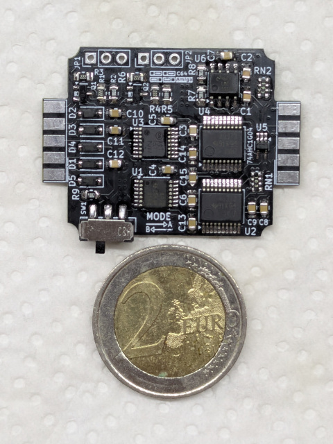
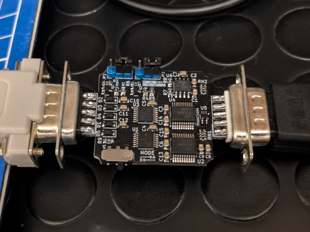

# The Padapter, Genesis/MegaDrive gamepad to C64/Amiga adapter

## DISCLAIMER

Any use of this project is **under your own responsibility**.
You will be responsible of checking the correct construction and functionality of your board.
By using this project You will agree that I cannot be held responsible if it will destroy any of your devices, damage your computer, burn down your house or whatever.

## Introduction

This board converts a SEGA MegaDrive/Genesis 3-button gamepad for C64 (and similar)/Amiga use. It is inspired by the [OpenC64MegaDrivePadAdapter](https://github.com/SukkoPera/OpenC64MegaDrivePadAdapter).

All buttons on the gamepad are demultiplexed and usable by the computer, the adapter also provides two switchable mappings to help with games that used the joystick up direction for jumping.

### Ordering the boards

You can order the board for this project at [PCBWay](https://www.pcbway.com/project/shareproject/TODO.html) and support me or download 
the gerbers and have them printed wherever you like!!!

Fabrication files are available for both PCBWay and JLCPCB inside the "gerbers" directory. Mind you that I have not yet tested assembly
of this board by either fab, as such you are on your own and you're invited to share your experience and improvements to these files.

## Features

- Small and made with common components
- Maps 3 buttons of the gamepad adapter, allowing their use on both C64 (and similar) and Amiga
- Two switchable button Maps

Amiga and C64 modes can be switched by moving JP1 and JP2:
- Pins 1-2 connected: Amiga Mode
- Pins 2-3 connected: C64 Mode

### Button Maps

Two button maps are available and switchable by flipping SW1 on the board.

They are switchable on the fly.

|              | Mode A   | Mode B   |
| ------------ | -------- | -------- |
| START        | Button 3 | Button 3 |
| A            | Button 3 | Button 2 |
| B            | Button 1 | Button 1 |
| C            | Button 2 | UP       |

## Hardware

The board was designed with [KiCad](https://kicad.org/) EDA.

### Bill of Materials

| Component              | Qty | Type / Value                                            | Notes                                                                |
| ---------------------- | --- | ------------------------------------------------------- | -------------------------------------------------------------------- |
| C1, C2                 |  2  | 10nF/10+V ceramic cap, SMD 0805                         |                                                                      |
| C3 - C15               | 13  | 100nF/10+V ceramic cap, SMD 0805                        |                                                                      |
| D1 - D5                |  5  | 1N4148W SOD-123F diode                                  |                                                                      |
| J1                     |  1  | DSUB-9 Female                                           | Connect toward C64/Amiga, use a connector with solder cups           |
| J2                     |  1  | DSUB-9 Male                                             | Connect toward MegaDrive pad, use a connector with solder cups       |
| JP1, JP2               |  2  | 3 pin 2.54mm headers                                    | Used to select between C64 and Amiga mode                            |
| Q1, Q2                 |  2  | BC847 SOT-23 transistors                                |                                                                      |
| R1, R3, R4, R6         |  4  | 2.2K ohm 0805 resistor                                  |                                                                      |
| R2, R5                 |  2  | 100K ohm 0805 resistor                                  |                                                                      |
| R7 - R9                |  3  | 10K ohm 0805 resistor                                   |                                                                      |
| RN1, RN2               |  2  | 10K resistor pack, 4x0612 (1206)                        |                                                                      |
| SW1                    |  1  | SPDT switch, C&K JS102011SAQN                           |                                                                      |
| U1                     |  1  | 74ACT08 TSSOP-14                                        |                                                                      |
| U2, U4                 |  2  | 74ACT373 SSOP-20                                        |                                                                      |
| U3                     |  1  | 74ACT157 TSSOP-16                                       |                                                                      |
| U5                     |  1  | 74AHC1G04 SOT-353 SC-70 5pin                            |                                                                      |
| 555                    |  1  | A CMOS 555 counter (e.g. LM555) SOIC-8                  |                                                                      |
